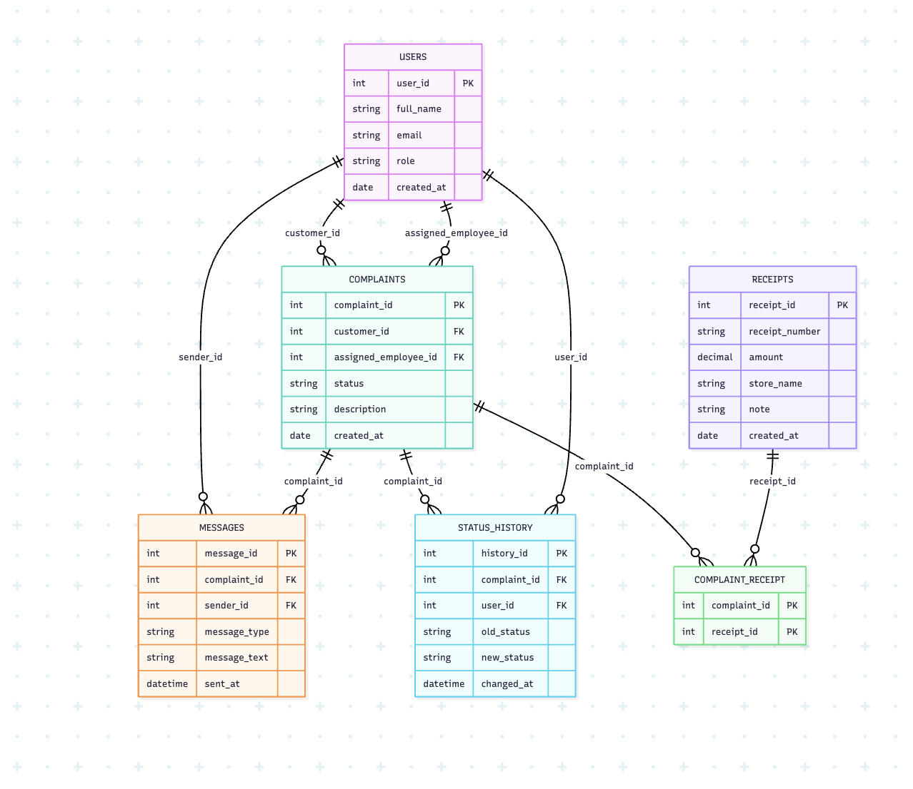
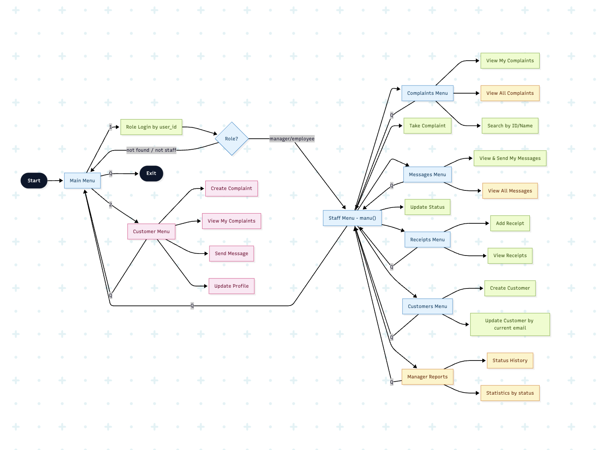

# Customer Service System

A Python + MySQL complaint management system with three roles:

1. Customer
2. Employee
3. Manager

## Project Diagrams

### 1. E/R Diagram



### 2. Python Flow Diagram



## Run

1. Create schema:
```bash
mysql -u root -p < first_time_setup.sql
```

2. Load test data:
```bash
mysql -u root -p < test_data.sql
```

3. Start app:
```bash
python3 main.py
```
